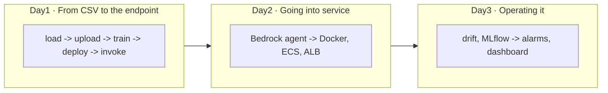

# aws-ds-starter

Working repository for the "AWS for Data Scientists" training — 3 days, in pairs,
industrial quality-control storyline.

**You write the missing code.** The signatures, docstrings, and comments are there;
the function bodies raise `NotImplementedError` with a task ID. `TODO.md` gives the
full list.

## Getting started

On your workstation (the repo isn't preinstalled there — you clone it, it's instant;
the packages, on the other hand, are already cached):

```bash
git clone https://github.com/ssime-git/aws-ds-starter.git
cd aws-ds-starter
cp .env.example .env      # then paste the .env snippet your trainer gave you
make sync                 # fast: the machine's uv cache is warm
set -a; . ./.env; set +a  # required before any Terraform command
uv run qc                 # where your pair currently stands
```

## Your Git work

During the normal course of the training, stay on the `main` branch. At each
end-of-day checkpoint, save your work in a **local** commit: no GitHub account or
`git push` is needed.

```bash
git status
git add -A
git commit -m "Checkpoint Day1 - model deployed"  # adapt to Day1, Day2 or Day3
```

Before switching branch or tag, run `git status`. Don't switch to another day's tag
inside your usual working directory.

## The tests are the assignment

```bash
make test
```

A failure names the task to do:

```
NotImplementedError: TODO-D1-12
```

Look up that ID in the code, write the function, run it again.

## Catching up on a day

End-of-day states are captured as tags. To restart from a clean base without
touching your own work, create a **new clone** in another folder:

```bash
cd ~
git clone https://github.com/ssime-git/aws-ds-starter.git aws-ds-catchup-day2
cd aws-ds-catchup-day2
git switch -c day-2 j1-fin        # or j2-fin for Day3
cp .env.example .env               # then paste the same .env snippet for your group
make sync
set -a; . ./.env; set +a
make check-day1
make restore-day1                  # only if the check is red
```

The tag resets the code to the right level; `make restore-day1` or `make restore-day2`
probes the real AWS state and only recreates what's missing. A new clone doesn't
create or delete any AWS resource by itself.

## The day guides

| | |
| --- | --- |
| [`docs/day-1.md`](docs/day-1.md) | from CSV to the SageMaker endpoint |
| [`docs/day-2.md`](docs/day-2.md) | Bedrock agent, Docker, ECS, ALB |
| [`docs/day-3.md`](docs/day-3.md) | drift, MLflow, alarms, incidents |
| [`docs/01-decisions.md`](docs/01-decisions.md) | the technical arbitrations, read when in doubt |

---

## The three days at a glance



Each label is a real command: `uv run qc load`, `uv run qc upload`, etc. `uv run qc`
with no argument shows where your pair currently stands.

---

## Layout

```
src/qc/                      the application, which learners grow ("qc" =
                              quality control, same prefix as the AWS resources)
app/main.py + Dockerfile     Day2 · Streamlit interface and its image
tests/                       one test file per module (= the assignment in the starter)
docs/                        Day1-3 briefs, decisions
infra/terraform/
  bootstrap/                 state bucket — local state, applied once
  socle/                     shared resources, applied by the trainer
  team/                      applied by each pair, separate state
scripts/                     preflight, check_dayN, restore_dayN...
```

No `day1/day2/day3` folders (D19): the three days grow *one single* application; the
order of the steps is carried by `uv run qc`.

## Three rules that explain most of the choices

1. **No `qc` module reads `os.environ`** — everything goes through `qc.config`, which
   reads `.env`. On the pair machines, `.env` contains **no credentials**: the EC2
   instance profile supplies the permissions.
2. **All Python goes through `uv`** — same project on Arch, Ubuntu and Amazon Linux.
3. **Shared AWS account**: isolation relies on the `qc-<TEAM_ID>` prefix, mandatory
   tags, and the IAM policies of the `qc-<TEAM_ID>-workstation` instance profile
   (explicit deny outside the prefix). Separate Terraform states: the socle on one
   side, a `team/<TEAM_ID>/` key per pair on the other.
